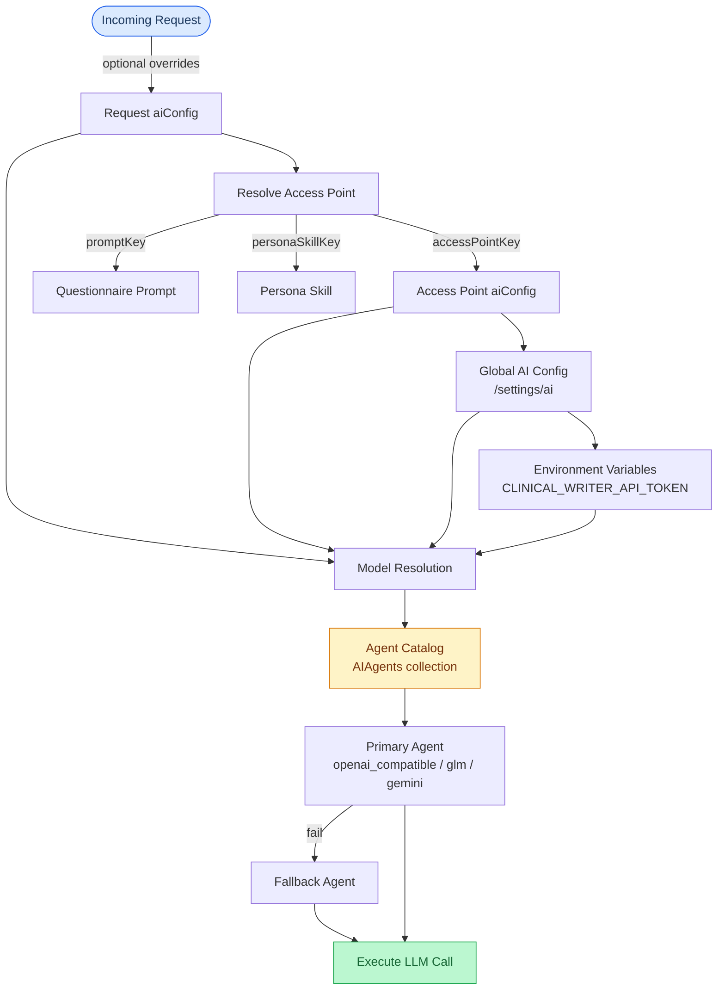

# AI Configuration Resolution Chain

How AI model configuration is resolved at runtime.

## Resolution Precedence

For prompt/persona/output selection:
1. Explicit request overrides
2. Access point bindings
3. Survey defaults

For AI model selection:
1. Explicit request `aiConfig`
2. Access point `aiConfig`
3. Global singleton `aiConfig` (`/settings/ai`)
4. Environment variable fallback

## Agent Catalog

Access points define an ordered `agentRefs` list with primary and fallback agents. If the primary agent fails, the system tries the next enabled agent in order. Agent definitions are stored in the `AIAgents` MongoDB collection and managed through Survey Builder.
