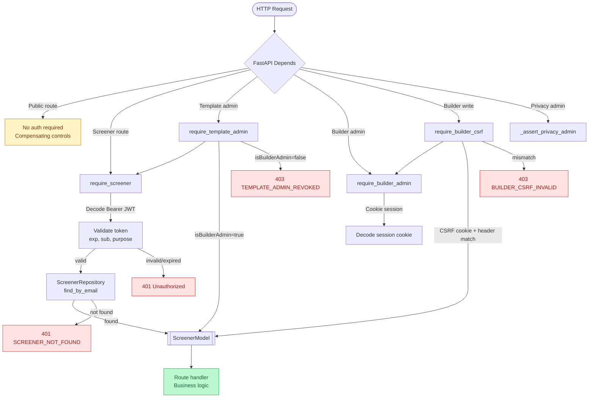

# FastAPI Authorization Dependency Pattern

How route authorization is enforced in survey-backend.

## Public Routes (Explicit Exceptions)

These mutating routes are intentionally public with compensating controls:

| Route | Control |
|:---|:---|
| `POST /screeners/register` | Rate limiting, schema validation |
| `POST /screeners/login` | Credential check |
| `POST /screeners/recover-password` | Rate limiting, email enumeration prevention |
| `POST /survey_responses/` | Access link token validation |
| `POST /patient_responses/` | Access link token validation |
| `POST /privacy/requests` | Rate limiting |
| `GET /screener_access_links/{token}` | Token-based resolution |
| `POST /builder/login` | Credential + admin check |

## Audit

`test_route_authorization_audit.py` dynamically inspects `app.routes` and asserts that all mutating endpoints (POST/PUT/PATCH/DELETE) have a recognized auth dependency or are listed as a public exception. New mutating routes will fail CI until protected.
