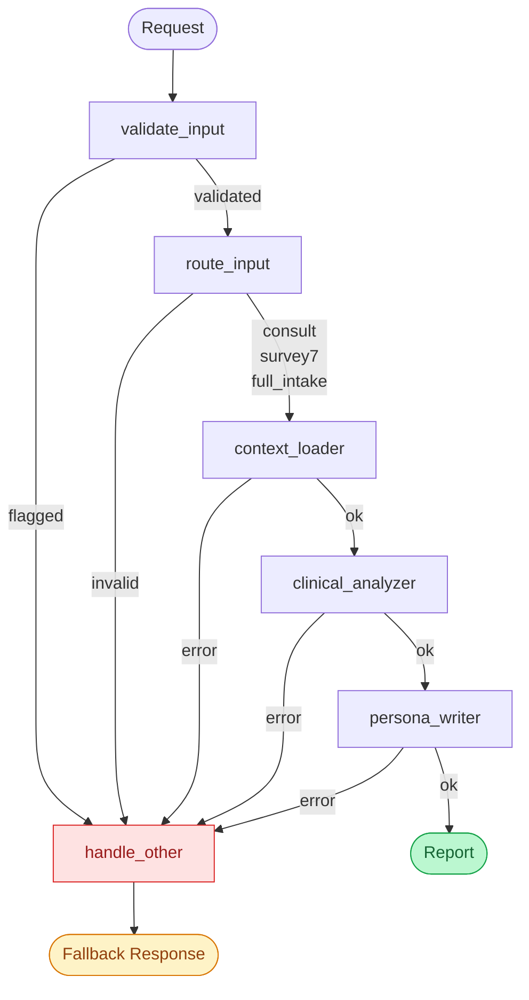

# LangGraph Orchestration Pipeline

Canonical visualization of the Clinical Writer state graph.

## Notes

- The **ReflectorNode** (reflection-based safety validation with PASS/FAIL loop up to 2 retries) was temporarily bypassed in the `optimize-ai-graph-and-fix-glm` change (May 2026) to reduce token consumption. The architectural intent is preserved — the code remains available for re-enabling.
- **OtherInputHandler** catches all error states, flagged content, and invalid input types, returning a minimal safe response.
- **Model routing** uses a primary (GLM) / fallback (Gemini) policy at the executor level, with higher-level agent catalog routing managed through Survey Builder.
