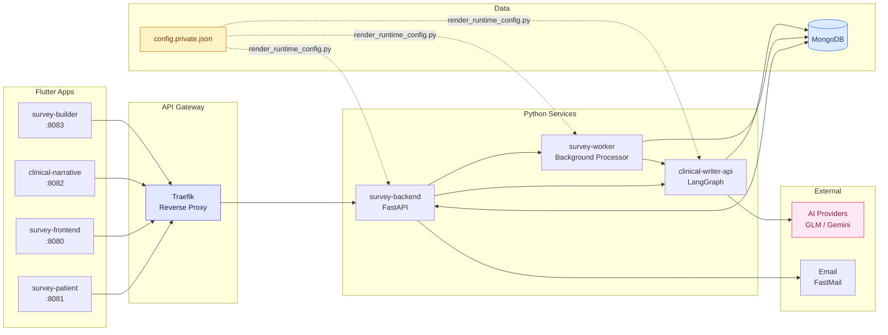
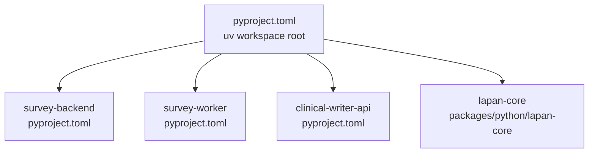

# System Architecture Overview

High-level service topology of the LAPAN Survey Platform.

## UV Workspace

All Python services share a single `uv.lock` at the repository root:

## Shared Packages

- `lapan-core` — cross-service security utilities (`security_boundaries.py`)
- `design_system_flutter` — shared Flutter theming and widgets
- `contracts` — OpenAPI spec with generated Dart/Python SDKs
