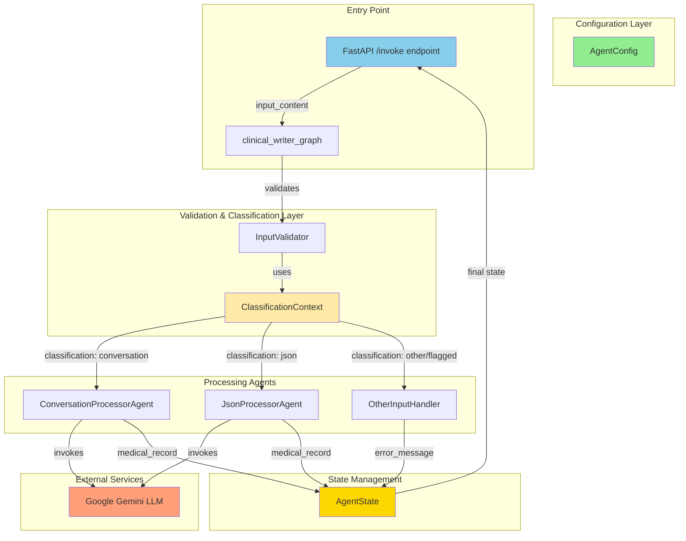

# System Architecture

The Clinical Writer AI is designed with a modular, scalable, and maintainable architecture, leveraging a microservices-based approach orchestrated by LangGraph.

## Architectural Diagram

The diagram below illustrates the high-level architecture of the system after the implementation of the Strategy Pattern for classification.

## Key Architectural Principles

*   **Centralized Configuration:** `AgentConfig` serves as the single source of truth for all settings, including API keys, model parameters, and file paths.
*   **Dependency Injection:** Components like the LLM are injected into agents, which allows for easy mocking and enhances testability.
*   **Separation of Concerns:** The architecture is divided into distinct layers for configuration, validation, processing, and state management.
*   **Strategy Pattern for Classification:** The input classification logic is implemented using the Strategy pattern, which makes it highly extensible and maintainable.

## Classification Strategy Pattern

The `InputValidator` delegates the classification task to a `ClassificationContext`, which manages a set of prioritized classification strategies. This design allows for new classification rules to be added without modifying the existing validation logic.

Each strategy is responsible for a single type of classification (e.g., JSON, conversation, inappropriate content). The strategies are applied in a predefined order of priority, ensuring, for example, that inappropriate content is detected before any other classification is attempted.

For a more detailed explanation of this pattern, see the [Classification Strategy Pattern](./architecture/classification_strategy.md) documentation.

## Component Responsibilities

| Component | Responsibility |
|---|---|
| `AgentConfig` | Provides all configuration for the application. |
| `InputValidator` | Orchestrates the input validation and classification process. |
| `ClassificationContext` | Manages and applies the various classification strategies. |
| `*Strategy` | Concrete implementations of classification logic. |
| `*Agent` | Agents responsible for processing the input and generating the medical report. |
| `AgentState` | A `TypedDict` that holds the state of the system as it flows through the graph. |
| `clinical_writer_graph` | The LangGraph graph that defines the overall workflow. |
| `main.py` | The FastAPI application that exposes the `/invoke` endpoint. |