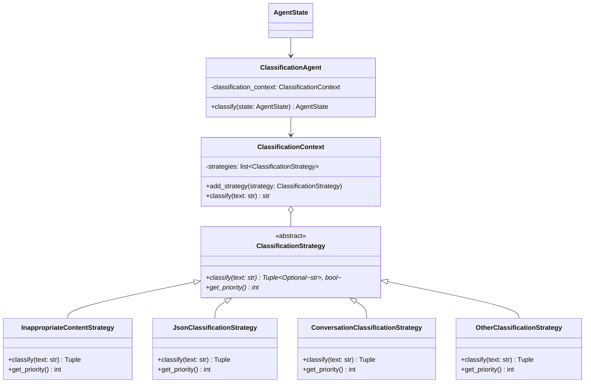
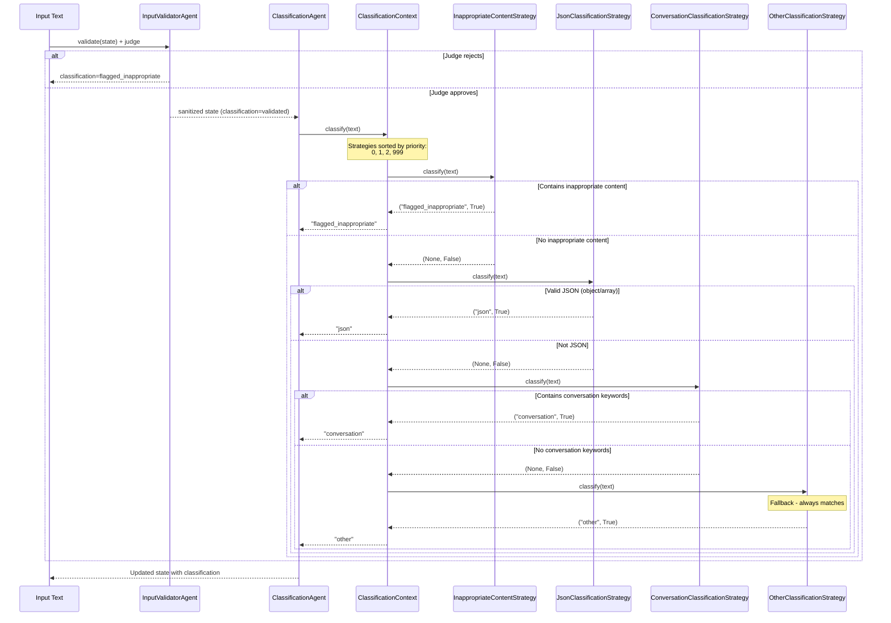

# Classification Strategy Pattern

The input classification logic in the Clinical Writer AI is implemented using the **Strategy Pattern**. This design pattern allows for defining a family of algorithms, encapsulating each one, and making them interchangeable. It lets the algorithm vary independently from the clients that use it. Validation is now handled separately (sanitization + LLM judge), and once content is deemed appropriate, the `ClassificationAgent` applies the strategies described below.

## Overview

The `ClassificationAgent` owns the Strategy Pattern implementation. It receives sanitized, validated text from the `InputValidatorAgent` (which performs LLM-based appropriateness scoring) and delegates to a `ClassificationContext`. This context manages a collection of `ClassificationStrategy` objects, each designed to identify a specific type of input (e.g., JSON, conversation, inappropriate content).

The strategies are executed in a prioritized order until one of them successfully classifies the input.

## Diagrams

### Class Diagram

This diagram shows the relationship between the `ClassificationAgent`, the `ClassificationContext`, and the various `ClassificationStrategy` implementations. The `InputValidatorAgent` now precedes this step and is responsible only for validation and judging, not classification.



### Sequence Diagram

This diagram illustrates the flow of control when a classification request is made.



## Implementation Details

The implementation consists of three main parts:

1.  **`ClassificationStrategy` Abstract Base Class:** Defines the interface for all strategies.
2.  **Concrete Strategies:** Each class implements the logic for a specific classification type.
3.  **`ClassificationContext`:** Manages the strategies and executes them.

### Strategies Implemented

| Strategy | Priority | Purpose |
|---|---|---|
| `InappropriateContentStrategy` | 0 (Highest) | Detects bad words, slang, emojis, markup, and ads. |
| `JsonClassificationStrategy` | 1 | Validates JSON payloads, including nested JSON-in-a-string forms. |
| `ConversationClassificationStrategy` | 2 | Detects conversation keywords. |
| `OtherClassificationStrategy` | 999 (Lowest) | A fallback strategy that classifies the input as "other". |

## Benefits of this Approach

*   **Single Responsibility Principle:** Each strategy has a single, well-defined purpose.
*   **Open/Closed Principle:** The system is open for extension (by adding new strategies) but closed for modification (no need to change existing strategies).
*   **Testability:** Each strategy can be tested in isolation.
*   **Maintainability:** The classification logic is easy to understand and modify.

## How to Add a New Strategy

To add a new classification strategy, you need to:

1.  Create a new class that inherits from `ClassificationStrategy`.
2.  Implement the `classify` and `get_priority` methods.
3.  Register an instance of your new strategy with the `ClassificationContext` in `classification_agent.py` (either by updating `AgentConfig.CLASSIFICATION_STRATEGY_FACTORIES` or by passing `extra_strategies` to the agent).

### Example

```python
# In classification_strategies.py
class EmailClassificationStrategy(ClassificationStrategy):
    """Strategy for classifying email-based input"""
    
    def classify(self, text: str) -> Tuple[Optional[str], bool]:
        """Check if text contains email patterns"""
        if '@' in text and 'email:' in text.lower():
            return ("email", True)
        return (None, False)
    
    def get_priority(self) -> int:
        """Set a priority for this strategy"""
        return 1  # Check after inappropriate content, before JSON

# In classification_agent.py
self.classification_context.add_strategy(EmailClassificationStrategy())
```
